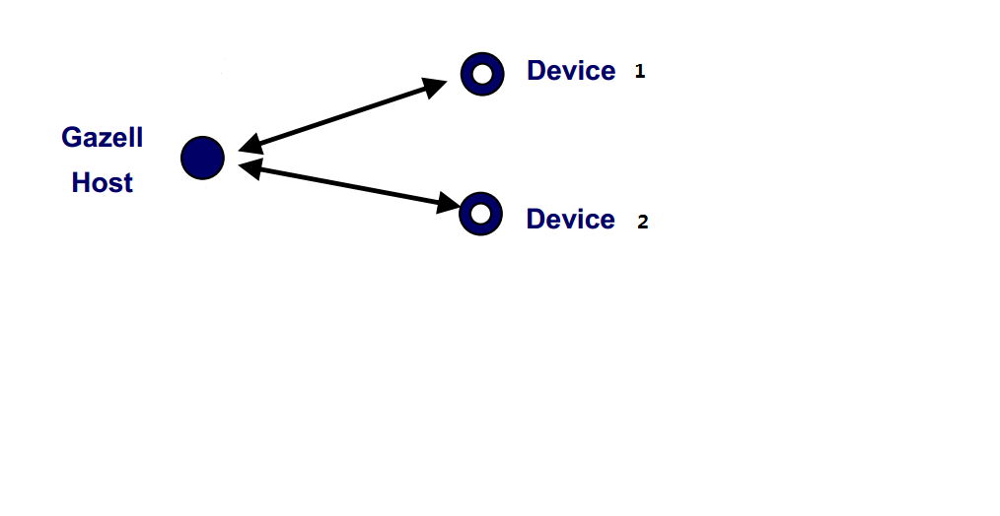

# Nordic Gazell Protocol
Nordic gazell protocol 1vs2 with a time sync feature and 240Hz date report rate

Gazell is a lightweight, low power, and easy-to-use protocol with advanced coexistence features expecially suited for wireless desktop products and other power-sensitive wireless applications. It is on-air compatible with Gazell on Nordic's nRF24Lxx ICs, and can share an nRF5 Series device with a Nordic SoftDevice.

## Design Objectives
* Support up to 2 devices in total (Bi-directional communication)
* Data frame rate of 240Hz puls
* Time sync between Host and Devices
* Channel selection feature will be added later..

## Roles and Network Topology

## Platform
* `Nordic 51xx/52xx`
